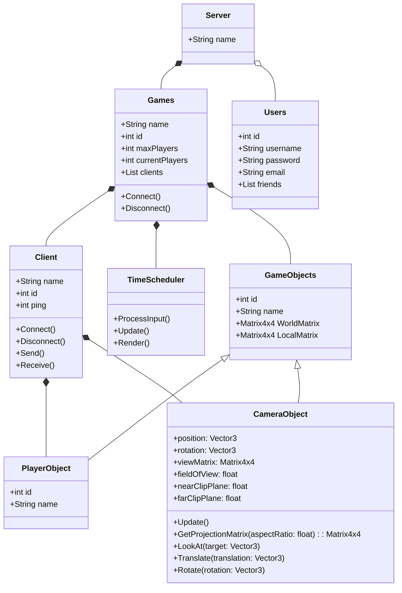

# Mermaid Class Diagram

```mermaid
classDiagram
    GameObjects <|-- PlayerObject
    Games *-- Client
    Server *-- Games
    Games *-- TimeScheduler
    Client *-- PlayerObject
    Games *-- GameObjects
    Client *-- CameraObject
    GameObjects <|-- CameraObject
    Server o-- Users
    class Server{
        +String name
    }
    class Users{
        +int id
        +String username
        +String password
        +String email
        +List<Friends> friends
    }
    class CameraObject {
        +position: Vector3
        +rotation: Vector3
        +viewMatrix: Matrix4x4
        +fieldOfView: float
        +nearClipPlane: float
        +farClipPlane: float
        +Update()
        +GetProjectionMatrix(aspectRatio: float): Matrix4x4
        +LookAt(target: Vector3)
        +Translate(translation: Vector3)
        +Rotate(rotation: Vector3)
}
    class Games{
        +String name
        +int id
        +int maxPlayers
        +int currentPlayers
        +List<Client> clients
        +Connect()
        +Disconnect()
    }
    class Client{
        +String name
        +int id
        +int ping
        +Connect()
        +Disconnect()
        +Send()
        +Receive()
    }
    class TimeScheduler{
        +ProcessInput()
        +Update()
        +Render()
    }
    class GameObjects{
        +int id
        +String name
        +Matrix4x4 WorldMatrix
        +Matrix4x4 LocalMatrix
    }
    class PlayerObject{
        +int id
        +String name
    }
```
