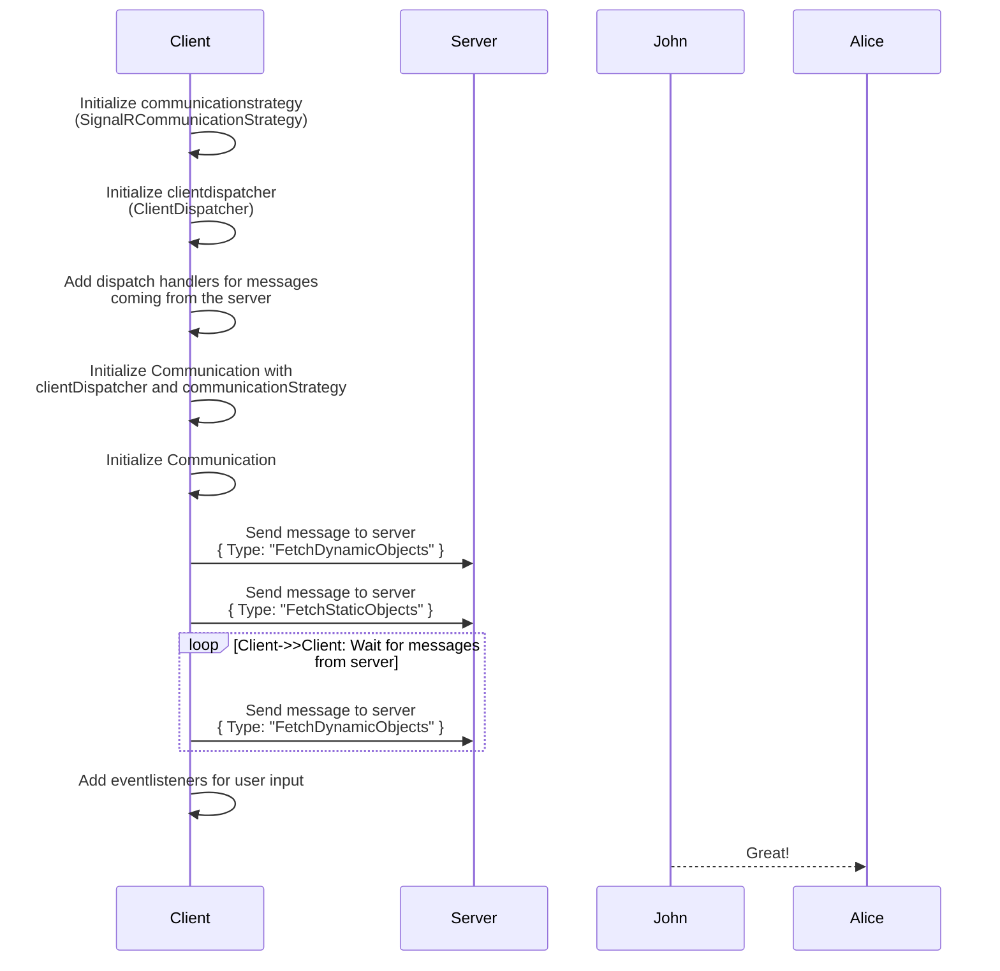
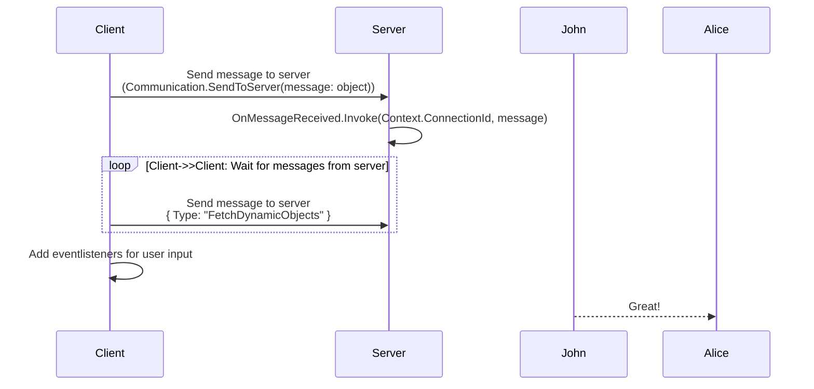
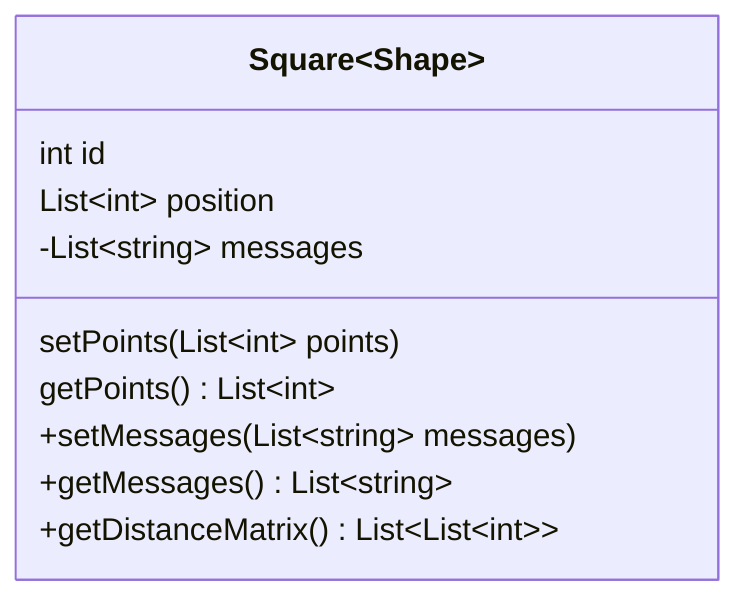

# Frontend

## Sequence Diagrams

```mermaid
sequenceDiagram
    Client->>Client: Initialize communicationstrategy<br>(SignalRCommunicationStrategy)
    Client->>Client: Initialize clientdispatcher<br>(ClientDispatcher)
    Client->>Client: Add dispatch handlers for messages<br> coming from the server
    Client->>Client: Initialize Communication with<br>clientDispatcher and communicationStrategy
    Client->>Client: Initialize Communication
    Client->>Server: Send message to server<br>{ Type: "FetchDynamicObjects" }
    Client->>Server: Send message to server<br>{ Type: "FetchStaticObjects" }
    loop Client->>Client: Wait for messages from server
        Client->>Server: Send message to server<br>{ Type: "FetchDynamicObjects" }
    end
    Client->>Client: Add eventlisteners for user input

    John-->>Alice: Great!
```

```mermaid
sequenceDiagram
    Client->>Server: Send message to server<br>(Communication.SendToServer(message: object))
    Server->>Server: OnMessageReceived.Invoke(Context.ConnectionId, message)
    loop Client->>Client: Wait for messages from server
        Client->>Server: Send message to server<br>{ Type: "FetchDynamicObjects" }
    end
    Client->>Client: Add eventlisteners for user input

    John-->>Alice: Great!
```

## Class Diagrams

```mermaid
    classDiagram
    class Square~Shape~{
    int id
    List~int~ position
    setPoints(List~int~ points)
    getPoints() List~int~
}

Square : -List~string~ messages
Square : +setMessages(List~string~ messages)
Square : +getMessages() List~string~
Square : +getDistanceMatrix() List~List~int~~
```
